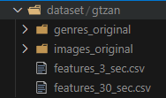

# Classification of mysic by genre using the ensemble classifier

> Author: Andrii Lytvyn 
> Group: KN-415

## Requirements

- PC with WSL2 support
- GPU with Nvidia CUDA support

## Setup guide

0. Download GTZAN dataset and put it into `dataset/gtzan` so the file tree looks like this: 

1. Set up WSL2 Ubuntu distribution.
2. Install `pyenv` in the WSL environment.
3. Install _Pylance_, _WSL_ and _Jupyter Notebook_ plugins for VSCode.
4. Connect to WSL using VSCode plugin.
5. Clone repository using `git` command into the environment and open it using `cd` command.
6. Execute following command to install required Python version and its dependencies: 
   `pyenv install` - installs required Python version 
   `python -m venv venv`- creates Python venv 
   `source venv/bin/activate` - activates the venv 
   `pip install -r requirements.txt` - installs Python dependencies 
7. Select correct Jupyter Notebook kernel before running notebook.
8. At this point you should be good to go.
